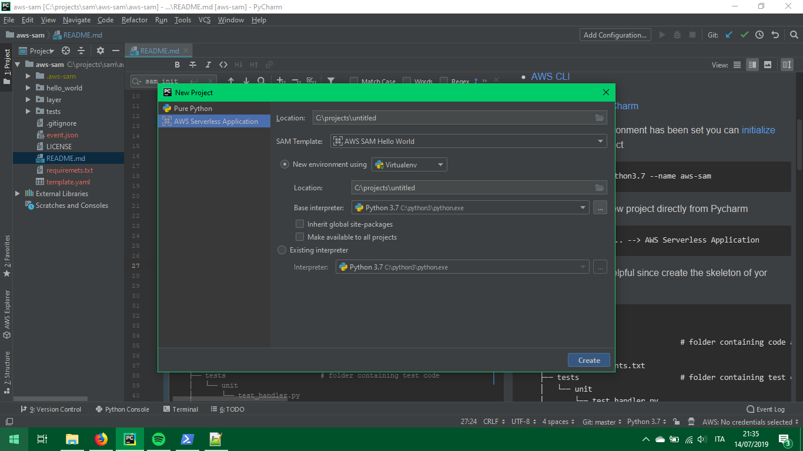

# aws-sam
A practical guide surviving to AWS SAM

## Set up

Install dependencies  
```bash
pip install -r requirements.txt
```

Configure [AWS CLI](https://docs.aws.amazon.com/en_us/cli/latest/userguide/cli-chap-configure.html) setting up credentials.

[OPTIONAL] Install [AWS Toolkit for PyCharm](https://docs.aws.amazon.com/en_us/toolkit-for-jetbrains/latest/userguide/setup-toolkit.html)

For details:
- [pytest](https://docs.pytest.org/en/latest/)
- [AWS CLI](https://docs.aws.amazon.com/en_us/cli/latest/userguide/cli-chap-install.html)
- [AWS SAM CLI](https://docs.aws.amazon.com/en_us/serverless-application-model/latest/developerguide/serverless-sam-cli-install.html)
- [AWS Toolkit for PyCharm](https://aws.amazon.com/it/pycharm/)

Now that your local environment has been set you can [initialize](https://docs.aws.amazon.com/en_us/serverless-application-model/latest/developerguide/sam-cli-command-reference-sam-init.html) you first AWS SAM project 
```bash
sam init --runtime python3.7 --name aws-sam
```
You can also create a new project directly from Pycharm 
```
File --> New Project... --> AWS Serverless Application 
```


This command is very helpful since create the skeleton of yor project 

```bash
.
└── aws-sam                         
    ├── hello_world                 # folder containing code and requirements of our lambda function
    │   ├── app.py
    │   └── requirements.txt
    ├── tests                       # folder containing test code
    │   └── unit
    │       └── test_handler.py
    ├── event.json                  # API gateway event example
    ├── README.md
    ├── template.yaml               # AWS SAM template 
    └── .gitignore
```

`template.yaml` file come with predefined a lambda function with an API gateway event

```yaml
AWSTemplateFormatVersion: '2010-09-09'
Transform: AWS::Serverless-2016-10-31
Description: >
  sam-app

  Sample SAM Template for sam-app

# More info about Globals: https://github.com/awslabs/serverless-application-model/blob/master/docs/globals.rst
Globals:
  Function:
    Timeout: 3

Resources:
  HelloWorldFunction:
    Type: AWS::Serverless::Function # More info about Function Resource: https://github.com/awslabs/serverless-application-model/blob/master/versions/2016-10-31.md#awsserverlessfunction
    Properties:
      CodeUri: hello_world/
      Handler: app.lambda_handler
      Runtime: python3.7
      Events:
        HelloWorld:
          Type: Api # More info about API Event Source: https://github.com/awslabs/serverless-application-model/blob/master/versions/2016-10-31.md#api
          Properties:
            Path: /hello
            Method: get

Outputs:
  # ServerlessRestApi is an implicit API created out of Events key under Serverless::Function
  # Find out more about other implicit resources you can reference within SAM
  # https://github.com/awslabs/serverless-application-model/blob/master/docs/internals/generated_resources.rst#api
  HelloWorldApi:
    Description: "API Gateway endpoint URL for Prod stage for Hello World function"
    Value: !Sub "https://${ServerlessRestApi}.execute-api.${AWS::Region}.amazonaws.com/Prod/hello/"
  HelloWorldFunction:
    Description: "Hello World Lambda Function ARN"
    Value: !GetAtt HelloWorldFunction.Arn
  HelloWorldFunctionIamRole:
    Description: "Implicit IAM Role created for Hello World function"
    Value: !GetAtt HelloWorldFunctionRole.Arn

```
## Build
For building dependencies AWS SAM CLI comes with a built-in [build](https://docs.aws.amazon.com/en_us/serverless-application-model/latest/developerguide/sam-cli-command-reference-sam-build.html) command 
```bash
sam build
```

The command will create a `.aws-sam` folder containing your code packaged with dependencies installed from `requirements.txt`
For our example will look like this
```bash
.
└── .aws-sam
    └── build
        ├── HelloWorldFunction
        │   ├── HelloWorldFunction 
        │   │   ├── app.py   
        │   │   └── ...             # packaged dependencies
        └── template.yaml
```
As you can see the command recreate the original tree substituting the name of the folder with the name of the resource defined.
Folder `hello_world` in your project became folder `HelloWorldFunction` like the name of the resource in `template.yaml` file.

Each of your lambda folder must contain a `requirements.txt` file specifying required dependencies, you will have so
maximum granularity specifying dependencies for each function but AWS SAM will have to install the dependencies for each 
lambda resulting in longer build time if your template contains an high number of lambda function.
TODO controllare se installa davvero per ogni requirments 

Keep also in mind that all the content of the folder you specify in `CodeUri` will be packaged for your lambda counting 
in the size limit of lambda deployment package.     
## Package
Now that all our dependencies have been downloaded we want to package all in way AWS lambda will accept our code.
AWS SAM is an optimized cloudformation for serverless application so it come with all the benefits (and drawback) of cloudformation.
One of the greatest advantage it's the possibility to use the built-in [package](https://docs.aws.amazon.com/en_us/serverless-application-model/latest/developerguide/sam-cli-command-reference-sam-package.html)
command.
TODO controllare se funziona prefix
```bash
sam package --template-file .aws-sam/build/template.yaml --s3-bucket artifact-bucket --s3-prefix aws-sam/versions/1 --output-template-file .aws-sam/build/template-packaged.yaml
```

## Deploy
```bash
sam deploy --stack-name hello-world-layer --template-file .aws-sam/build/template-packaged.yaml --capabilities CAPABILITY_IAM
```

## Test


