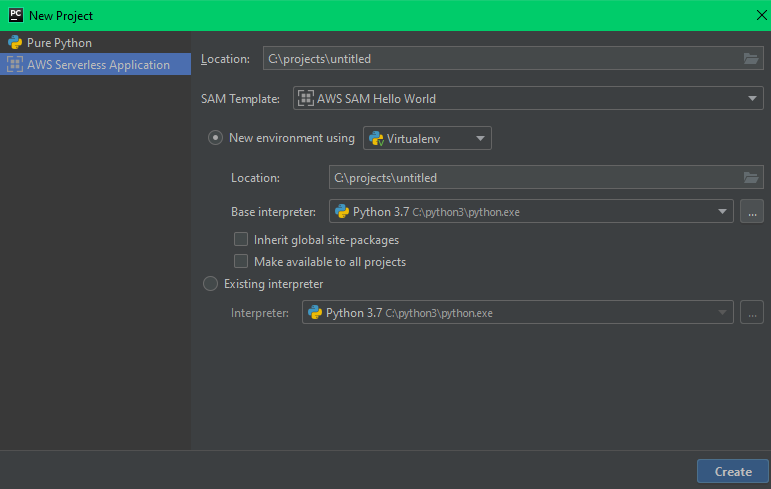

# aws-sam
A practical guide surviving to AWS SAM

## Set up

Install dependencies  
```bash
pip install -r requirements.txt
```

Configure [AWS CLI](https://docs.aws.amazon.com/en_us/cli/latest/userguide/cli-chap-configure.html) setting up credentials.

[OPTIONAL] Install [AWS Toolkit for PyCharm](https://docs.aws.amazon.com/en_us/toolkit-for-jetbrains/latest/userguide/setup-toolkit.html)

For details:
- [pytest](https://docs.pytest.org/en/latest/)
- [AWS CLI](https://docs.aws.amazon.com/en_us/cli/latest/userguide/cli-chap-install.html)
- [AWS SAM CLI](https://docs.aws.amazon.com/en_us/serverless-application-model/latest/developerguide/serverless-sam-cli-install.html)
- [Docker](https://www.docker.com/) unfortunately AWS SAM needs docker to spin up a container running locally your function with respect to competitors like serverless framework thatn don't
- [AWS Toolkit for PyCharm](https://aws.amazon.com/it/pycharm/)

Now that your local environment has been set you can [initialize](https://docs.aws.amazon.com/en_us/serverless-application-model/latest/developerguide/sam-cli-command-reference-sam-init.html) you first AWS SAM project 
```bash
sam init --runtime python3.7 --name aws-sam
```
You can also create a new project directly from Pycharm 
```
File --> New Project... --> AWS Serverless Application 
```


This command is very helpful since create the skeleton of your project 

```bash
.
└── aws-sam                         
    ├── hello_world                 # folder containing code and requirements of our lambda function
    │   ├── app.py
    │   └── requirements.txt
    ├── tests                       # folder containing test code
    │   └── unit
    │       └── test_handler.py
    ├── event.json                  # API gateway event example
    ├── README.md
    ├── template.yaml               # AWS SAM template 
    └── .gitignore
```

`template.yaml` file come with predefined a lambda function with an API gateway event

```yaml
AWSTemplateFormatVersion: '2010-09-09'
Transform: AWS::Serverless-2016-10-31
Description: >
  sam-app

  Sample SAM Template for sam-app

# More info about Globals: https://github.com/awslabs/serverless-application-model/blob/master/docs/globals.rst
Globals:
  Function:
    Timeout: 3

Resources:
  HelloWorldFunction:
    Type: AWS::Serverless::Function # More info about Function Resource: https://github.com/awslabs/serverless-application-model/blob/master/versions/2016-10-31.md#awsserverlessfunction
    Properties:
      CodeUri: hello_world/
      Handler: app.lambda_handler
      Runtime: python3.7
      Events:
        HelloWorld:
          Type: Api # More info about API Event Source: https://github.com/awslabs/serverless-application-model/blob/master/versions/2016-10-31.md#api
          Properties:
            Path: /hello
            Method: get

Outputs:
  # ServerlessRestApi is an implicit API created out of Events key under Serverless::Function
  # Find out more about other implicit resources you can reference within SAM
  # https://github.com/awslabs/serverless-application-model/blob/master/docs/internals/generated_resources.rst#api
  HelloWorldApi:
    Description: "API Gateway endpoint URL for Prod stage for Hello World function"
    Value: !Sub "https://${ServerlessRestApi}.execute-api.${AWS::Region}.amazonaws.com/Prod/hello/"
  HelloWorldFunction:
    Description: "Hello World Lambda Function ARN"
    Value: !GetAtt HelloWorldFunction.Arn
  HelloWorldFunctionIamRole:
    Description: "Implicit IAM Role created for Hello World function"
    Value: !GetAtt HelloWorldFunctionRole.Arn

```
## Build
For building dependencies AWS SAM CLI comes with a built-in [build](https://docs.aws.amazon.com/en_us/serverless-application-model/latest/developerguide/sam-cli-command-reference-sam-build.html) command 
```bash
sam build --template template.yaml
```

The command will create a `.aws-sam` folder containing your code packaged with dependencies installed from `requirements.txt`
For our example will look like this
```bash
.
└── .aws-sam
    └── build
        ├── HelloWorldFunction
        │   ├── HelloWorldFunction 
        │   │   ├── app.py   
        │   │   └── ...             # packaged dependencies
        └── template.yaml
```
As you can see the command recreate the original tree substituting the name of the folder with the name of the resource defined.
Folder `hello_world` in your project became folder `HelloWorldFunction` like the name of the resource in `template.yaml` file.

Each of your lambda folder must contain a `requirements.txt` file specifying required dependencies, you will have so
maximum granularity specifying dependencies for each function but AWS SAM will have to install the dependencies for each 
lambda resulting in longer build time if your template contains an high number of lambda function. 

Keep also in mind that all the content of the folder you specify in `CodeUri` will be packaged for your lambda, counting 
in the size limit of lambda deployment package.  
   
## Package
Now that all our dependencies have been downloaded we want to package all in way AWS lambda will accept our code.
AWS SAM is an optimized cloudformation for serverless application so it come with all the benefits (and pains) of cloudformation.
One of the greatest advantage it's the possibility to use the built-in [package](https://docs.aws.amazon.com/en_us/serverless-application-model/latest/developerguide/sam-cli-command-reference-sam-package.html)
command.
```bash
sam package --template-file .aws-sam/build/template.yaml --s3-bucket artifact-bucket --s3-prefix aws-sam/versions/1 --output-template-file .aws-sam/build/template-packaged.yaml
```
This command package all your code, upload it on S3 and update your template `CodeUri` with the correct S3 key.

I suggest you to take advantage of the `--s3-prefix` parameter to create a clean structure also for yuor deployments,
otherwise you will end with all your package in the root of your S3 bucket.

Our packaged template will look like this
```yaml
AWSTemplateFormatVersion: '2010-09-09'
Description: 'sam-app

  Sample SAM Template for sam-app

  '
Globals:
  Function:
    Timeout: 3
Outputs:
  HelloWorldApi:
    Description: API Gateway endpoint URL for Prod stage for Hello World function
    Value:
      Fn::Sub: https://${ServerlessRestApi}.execute-api.${AWS::Region}.amazonaws.com/Prod/hello/
  HelloWorldFunction:
    Description: Hello World Lambda Function ARN
    Value:
      Fn::GetAtt:
      - HelloWorldFunction
      - Arn
  HelloWorldFunctionIamRole:
    Description: Implicit IAM Role created for Hello World function
    Value:
      Fn::GetAtt:
      - HelloWorldFunctionRole
      - Arn
Resources:
  HelloWorldFunction:
    Properties:
      CodeUri: s3://artifact-bucket/aws-sam/versions/1/b891a08245ed5940781e64b483cbcb14
      Events:
        HelloWorld:
          Properties:
            Method: get
            Path: /hello
          Type: Api
      Handler: app.lambda_handler
      Runtime: python3.7
    Type: AWS::Serverless::Function
Transform: AWS::Serverless-2016-10-31
```
As you can see `CodeUri` path now points to an S3 key, containing our package.

## Deploy
It's now time to see our application working for real.
As stated before we can use the utilities of cloudformation in particular we can leverage [deploy](https://docs.aws.amazon.com/serverless-application-model/latest/developerguide/sam-cli-command-reference-sam-deploy.html) command
```bash
sam deploy --stack-name hello-world-sam --template-file .aws-sam/build/template-packaged.yaml --capabilities CAPABILITY_IAM
```
As you can see we are telling sam to deploy our `template-packaged.yaml` template, the one generated from package command,
Cloudformation will read the template and create all the resource defined within it.

We can check the correct deployment from aws cloudfromation console


## Test
Till now we have assumed all our code and configurations are correct, once deployed all will work like a charm...but usually it's not the case,
testing it's always an important step to keep in mind when your are developing an application. In the world of serverless 
testing strategies has changed a little focusing more on the integration rather than unit introducing new challenges.
Try to define a testing strategies for all the components of your application from template passing through the code till the 
roles your function will have once deployed.

AWS SAM comes with many utilities for testing an application, let's start with [validate](https://docs.aws.amazon.com/serverless-application-model/latest/developerguide/sam-cli-command-reference-sam-validate.html)
command, utility letting you check whenever your template is syntactically valid.

```bash
sam validate --template template.yaml
```

Passing to code we can use [local invoke](https://docs.aws.amazon.com/en_us/serverless-application-model/latest/developerguide/sam-cli-command-reference-sam-local-invoke.html)
command that let you invoke locally your lambda handler with a mocked event.

```bash
sam local invoke --event event.json
```

You can also invoke your function directly from the template within Pycharm with the AWS Toolkit 


And from Run/Debug configuration you can set basic information like AWS credential to be used, automatically loaded from [AWS CLI](https://docs.aws.amazon.com/cli/latest/userguide/cli-configure-files.html) configuration. 


If you have created the project from CLI or you have added new function and you try to run a function you may incur in the following error


This problem can be easily solved adding the folder marking your function as **source root**


Another useful utility it's the possibility to [locally start](https://docs.aws.amazon.com/serverless-application-model/latest/developerguide/sam-cli-command-reference-sam-local-start-api.html) 
an API gateway hosting all your function

```bash
sam local start-api 
```
Now you can locally invoke your HTTP endpoint, with an API manager like [Postman](https://www.getpostman.com/).

If your want to test your function within python you can use one of the testing libraries supported and locally invoke un lambda handler function.
AWS SAM init preconfigure for you a `tests` folder containing an example.
Here i reported a slightly different version leveraging the  `event.json` file instead of generating event directly from code.

```python
import json
import pytest
from hello_world import app


@pytest.fixture()
def apigw_event():
    """ Generates API GW Event"""
    with open("../../event.json") as json_file:
        return json.load(json_file)


def test_lambda_handler(apigw_event, mocker):
    ret = app.lambda_handler(apigw_event, "")
    data = json.loads(ret["body"])

    assert ret["statusCode"] == 200
    assert "message" in ret["body"]
    assert data["message"] == "hello world!"
    # assert "location" in data.dict_keys()
```

If you are experiencing problems with import of your function from test folder check if [sys path](https://leemendelowitz.github.io/blog/how-does-python-find-packages.html)
are correctly set.

## Next step

In the second part we will dig into detail of using a lambda layer in particular we will point the attention on how to test 
it locally.
Third part will cover in detail how to embed the deployment of our application in a CI/CD release pipeline with codecommit, codebuild and codedeploy