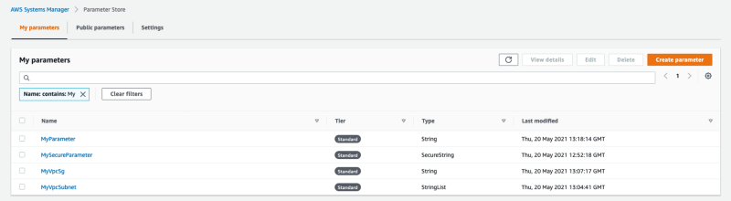

# A practical guide surviving to AWS SAM part 5 - Parameters

[Medium article]()

This folder contains an example template containing various method to handle parameters in AWS SAM

To deploy this template you should create three Parameter Store entry:

* **MyVpcSubnet** <StringList>: comma separated list with Subnets to be used by Lambda function, Subnets should grant access 
  to SSM Parameter Store
* **MyVpcSg** <String>: Security Group to be used by Lambda function, Security Group should grand access to SSM Parameter Store
* **MyParameter** <String>: generic string



If you don't want to configure the VPC, comment the part involving this parameters in `Resources` and `Parameters` sections.

To build the application if you have trouble add `--use-container` flag forcing SAM to use a Docker container to build your application,
Docker should be up and running.

```shell
sam build --use-container
```

To deploy the application you can use the guided deployment and follow the instruction

```shell
sam deploy --guided
```

or you can force parameter values with `--parameter-overrides` flag

```shell
sam deploy --parameter-overrides Env=dev
```