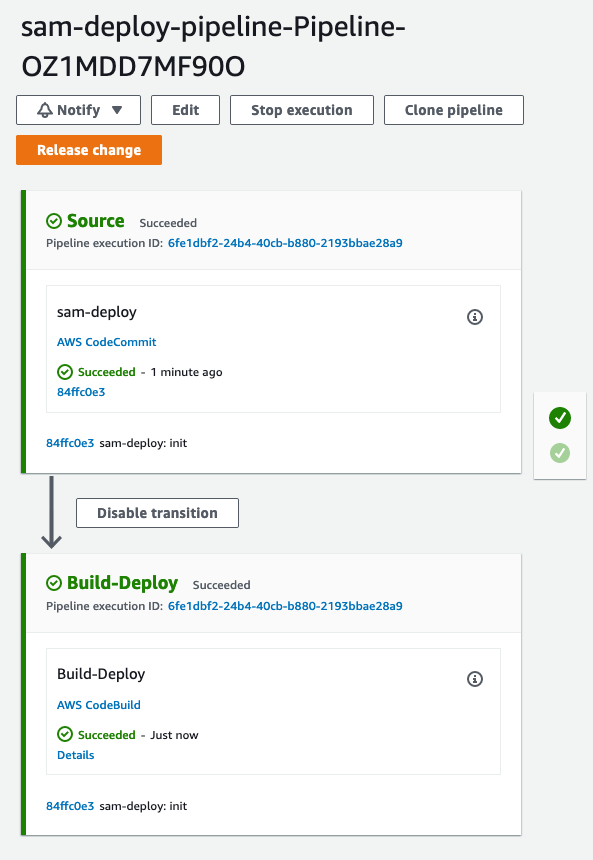
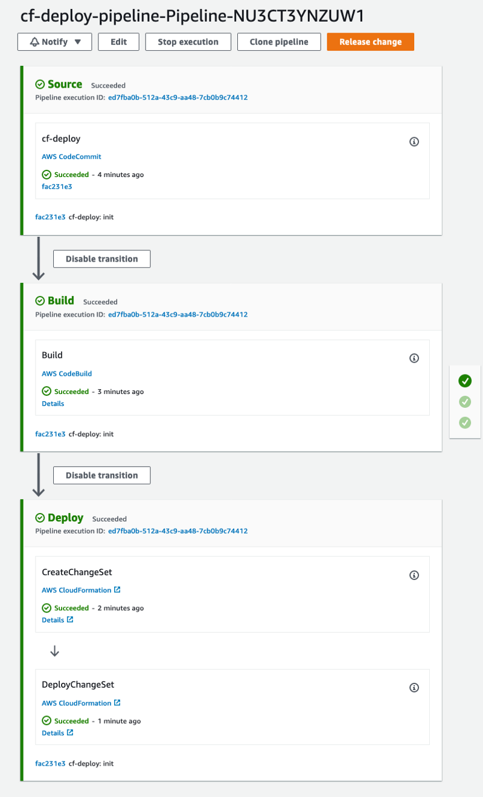

# A practical guide surviving to AWS SAM part 4 - Release Change

[Medium article](https://aws.plainenglish.io/a-practical-guide-to-surviving-aws-sam-9a1070c8b3e8?source=friends_link&sk=eb969cfaaf5aecc9048875afdda3942e)

This folder contains resources about CodePipeline Release Change for AWS SAM. 

## [SAM deploy pipeline](sam_deploy)

Pipeline with build package and deploy performed by CodeBuild

## [CloudFormation deploy](cf_deploy)

Pipeline with build and package performed by CodeBuild while deployment managed by CloudFormation action embedded in
CodePipeline

