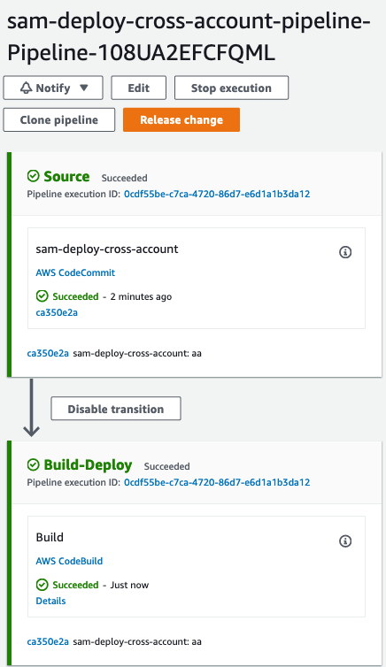

# A practical guide surviving to AWS SAM part 4 - Release Change

* [Medium article single account](https://aws.plainenglish.io/a-practical-guide-to-surviving-aws-sam-9a1070c8b3e8?source=friends_link&sk=eb969cfaaf5aecc9048875afdda3942e)
* [Medium article cross account](https://aws.plainenglish.io/a-practical-guide-to-surviving-aws-sam-2249f9475055?source=friends_link&sk=6083805cddbdc75e4d43977200a10f8f)

This folder contains resources about CodePipeline Release Change for AWS SAM. 

## [SAM deploy pipeline](sam_deploy)

Pipeline with build package and deploy performed by CodeBuild

## [CloudFormation deploy](cf_deploy)

Pipeline with build and package performed by CodeBuild while deployment managed by CloudFormation action embedded in
CodePipeline

## [SAM deploy pipeline cross account](sam_deploy_cross_account)

Pipeline with build package and deploy performed by CodeBuild. Application will be deployed to a different account where 
resources are created

## [CloudFormation deploy cross account](cf_deploy_cross_account)

Pipeline with build and package performed by CodeBuild while deployment managed by CloudFormation action embedded in
CodePipeline. Application will be deployed to a different account where resources are created

