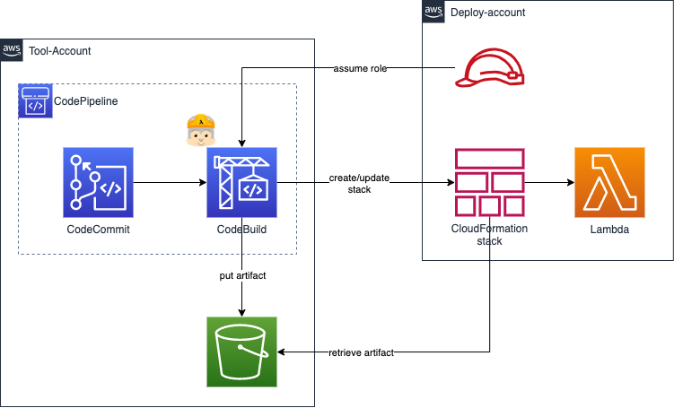

# SAM deploy pipeline cross account



## Pipeline creation

On Tool Account create the following CloudFormation stack

```shell
aws cloudformation create-stack \
    --stack-name sam-deploy-cross-account-pipeline \
    --template-body file://pipeline_template.yaml \
    --capabilities CAPABILITY_NAMED_IAM \
    --parameters \
      ParameterKey=DeployAccountId,ParameterValue=<deploy-account> \
      ParameterKey=AddBucketPolicy,ParameterValue=false
```

It's now time to move on Deploy Account and deploy IAM Role that will be assumed by CodeBuild to actually deploy the application. 
`ArtifactBucket` and `CMKARN` can be retrieved from Outputs section of previously deployed stack 

```shell
aws cloudformation create-stack \
    --stack-name sam-deploy-cross-account-role \
    --template-body file://deployer_role_template.yaml \
    --capabilities CAPABILITY_NAMED_IAM \
    --parameters \
      ParameterKey=ArtifactBucket,ParameterValue=<artifact-bucket> \
      ParameterKey=ToolAccountId,ParameterValue=<deploy-account> \
      ParameterKey=CMKARN,ParameterValue=<KMS-arn>
```

Now you have to update the CloudFormation stack on Tool Account to attach S3 bucket policy granting cross account access.
This action needs to be performed after deploy role has been created otherwise you will encounter an `Invalid principal in policy`
telling you that the Role you are trying to associate to the bucket policy doesn't exist.

```shell
aws cloudformation create-change-set \
    --change-set-name update \
    --stack-name sam-deploy-cross-account-pipeline \
    --template-body file://pipeline_template.yaml \
    --capabilities CAPABILITY_NAMED_IAM \
    --parameters \
      ParameterKey=DeployAccountId,ParameterValue=<deploy-account> \
      ParameterKey=AddBucketPolicy,ParameterValue=true 
```

Once the Change Set has been created from the AWS console you should see a change set `update` ready to be executed,
if you look at the change set you should see an Action telling that will be created the `ArtifactBucketPolicy`.


After executing the change set the bucket policy should be visible from S3 permission tab.

## Application deployment

Deployment will be managed by the pipeline at each push