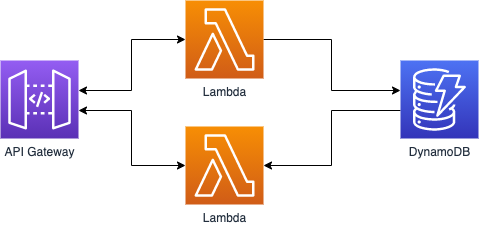
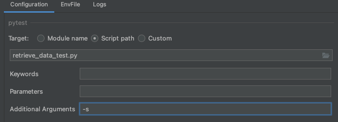

# A practical guide surviving to AWS SAM part 7 - Tests

[Medium article](https://aws.plainenglish.io/a-practical-guide-to-surviving-aws-sam-acc7bd39e505)

This folder contains resources about Lambda Tests.



## Execution

Before running test the application should be deployed to interact with DynamoDB table

```shell
sam build
sam deploy --guided
```
To execute test locally with PyCharm mark as source root the following folder

* tests
* layer

From the Run/Debug configurations set TABLE_NAME environment variable and run the test. Keep attention
that from IDE preferences Tools --> Python Integrated Tools must be set pytest as testing provider.

Instead if you want to run test from CLI you can run the following commands

```shell
cd test
export TABLE_NAME=<table-name>
pytest
```

Next chapter of the series we will se methods to make test procedure easier.

## Troubleshooting

If your AWS local AWS user has been configured with MFA authentication to run test from PyCharm you have to add
`-s` flag as `Additional Argument` for pytest otherwise keyboard input will be suppressed resulting in an authentication failure.

